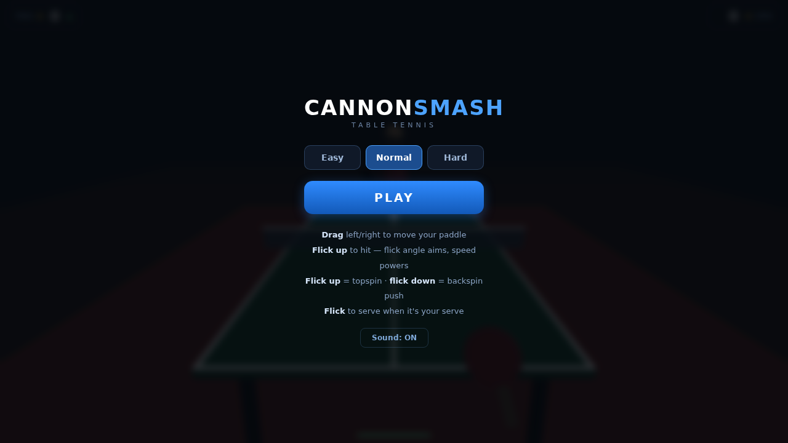
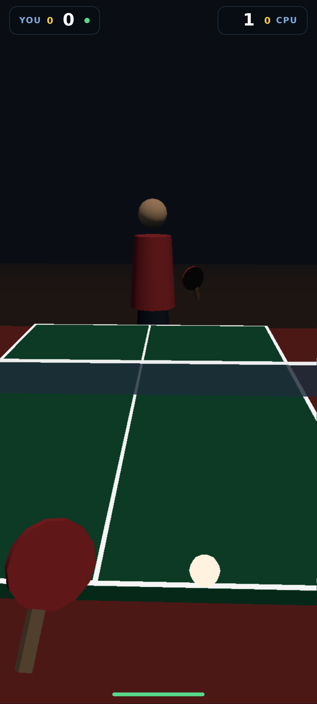

# CannonSmash Web

A browser-based, mobile-first remake of [CannonSmash](https://cannonsmash.sourceforge.net/)
(the classic open-source 3D table tennis game), true to the original's physics
and assisted-control feel, rebuilt around touch.

**Play:** https://cannonsmash.exe.xyz/





## Controls (touch / mouse)

| Gesture | Action |
|---|---|
| **Drag left/right** | Move your player/paddle laterally (finger = paddle) |
| **Flick up** | Swing. Flick angle aims left/right, flick speed & length = power, upward flick = topspin drive |
| **Flick down** | Backspin push |
| **Flick (on your serve)** | Toss + serve |
| **✕ (top center)** | Quit match, back to menu |
| **Tap (after match)** | Return to menu |

The ball must actually be within paddle reach when it arrives — if you're out
of position, you whiff. When you're not dragging, a positioning assist drifts
you toward the predicted contact point (the original game also auto-positioned
during the backswing); the assist gets slower on higher difficulties, so
manual positioning matters more.

## Rules

11-point games, deuce (win by 2), serve rotation every 2 points (every point at
deuce), best of 3 games.

## Development

```
npm install
npm run dev        # vite dev server on :8000
npm run build      # production build to dist/
npm run typecheck
npx tsx test/sim.ts     # headless full-match simulation
npx tsx test/human.ts   # sloppy-human sim across all difficulties
```

Deployed as a static build served by busybox httpd via systemd
(`cannonsmash.service`). After building: `sudo systemctl restart cannonsmash`.

See [docs/DESIGN.md](docs/DESIGN.md) for architecture, physics notes, tuning
rationale, and the project plan/history.
